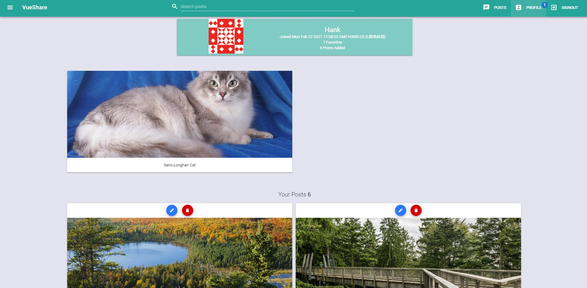
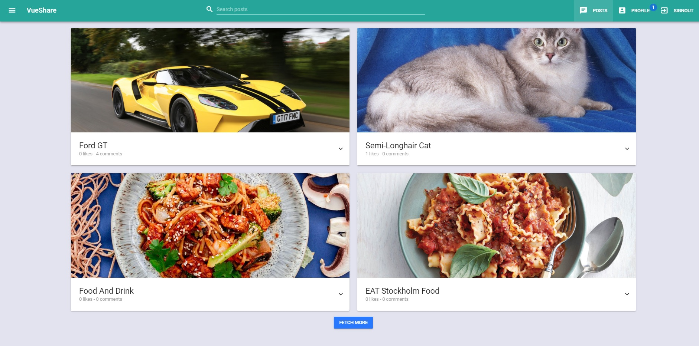

# Vue.js  部落格網站
部落格網站實作練習使用 Vue & node.js Gql 專案，使用 Graphql API，涵蓋 文章(CRUD)、加入我的最愛、搜尋文章，使用者(CRUD)，登入/登出等功能。

# 技術
* Node
* Mongodb
* jsonwebtoken
* Vue
* Graphql
* Apollo

# 插建
* vuetify

# variables.env
* MONGOD_URI:YOUR_URL
* SECRET=YOUR_SECRET_CODE
